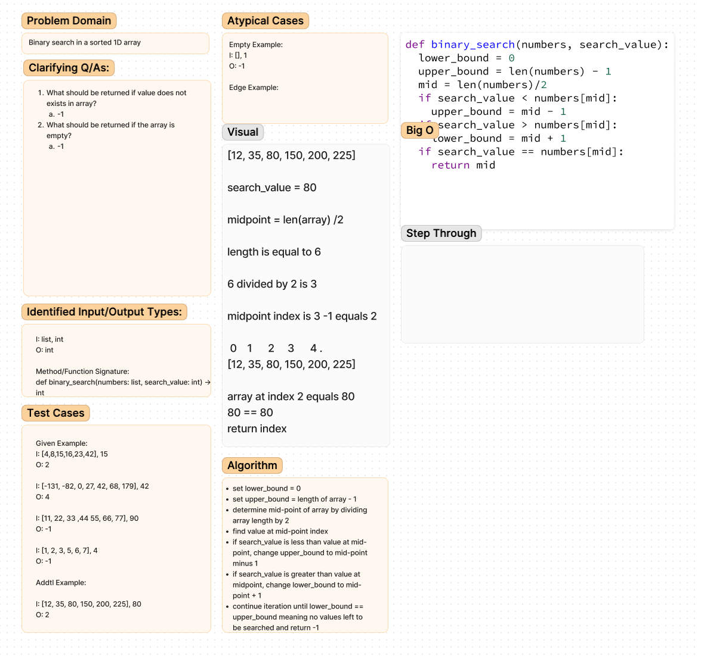

# Challenge Title
Array binary search

## Whiteboard Process

## Approach & Efficiency
binary search because it is an ordered array. According the geeksforgeeks, the Big O space/time for this approach is O(logn) and O(1).

## Solution
<!-- Show how to run your code, and examples of it in action -->

## Attribution
[bio o](https://www.geeksforgeeks.org/complexity-analysis-of-binary-search/)
