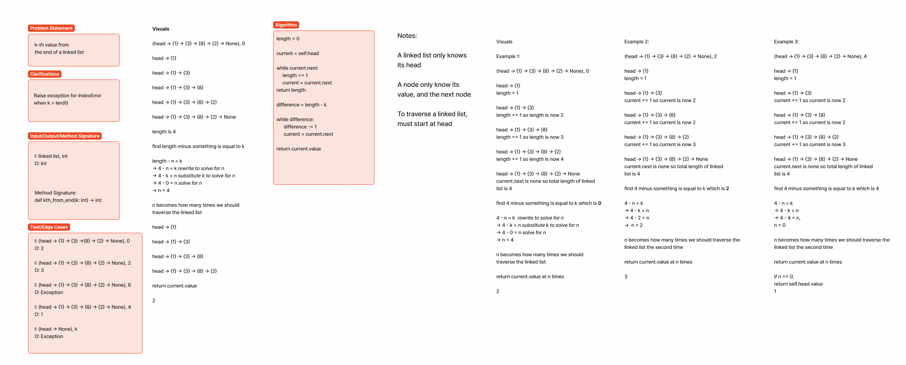

# Challenge Title
linked_list_kth

## Whiteboard Process
<!-- Embedded whiteboard image -->

## Approach & Efficiency
I traversed the linked list twice. First is to find the length, second is to start at the head and traverse the nodes, length of linked list minus k, times. Big O for time complexity is O(2n) because depending on how long the linked list is, the algorithm or number of steps is 2 times n for worst case scenario, constant is dropped therefore time complexity is just O(n). I am unsure of space complexity. Haven't read that far.

## Solution
<!-- Show how to run your code, and examples of it in action -->

## Attribution

