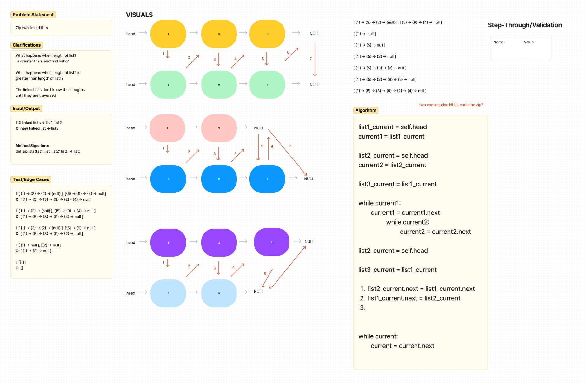

# Challenge Title
linked_list_zip

## Whiteboard Process
<!-- Embedded whiteboard image -->

## Approach & Efficiency
I think the solution involves reassigning pointers for each node but I'm unsure how to capture the exact steps and how to translate that into code. I think Big O for time complexity would be O(n). Space complexity would be also be O(n) because the size of the new linked list would be equal to size of the two inputs.

## Solution
<!-- Show how to run your code, and examples of it in action -->
I do not have a solution at this time.

## Attribution

