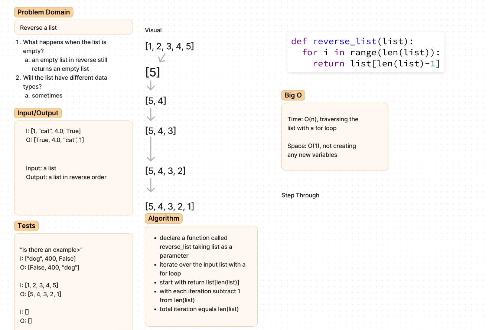

# Challenge Title
reverse list

## Whiteboard Process

## Approach & Efficiency
Originally, I wanted to use list.reverse() but decided to opt for list[-1] and somehow decrementing the index with each iteration

## Solution
solution is incomplete

## Attribution

https://datagy.io/python-reverse-list/

class demo
