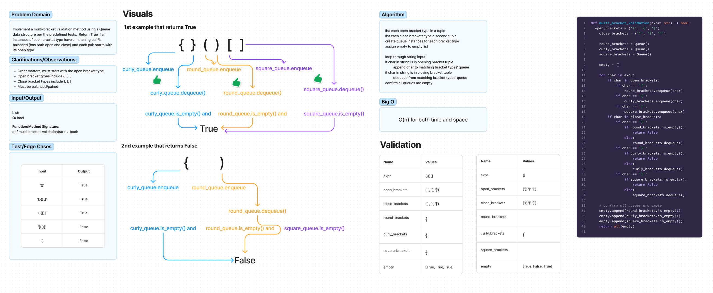

# Challenge Title
Multi-bracket Validation

## Whiteboard Process

## Approach & Efficiency
I created three different queues for each type of bracket. If the bracket is an opening type, it is enqueued to the queue that matches its type. If the bracket is a closing type, then its corresponding queue is dequeued. Final step was to confirm each queue was empty. The Big O for both time and space complexity is O(n).

## Solution
pytest -k test_stack_queue_brackets.py

## Attribution

- [Implementation examples using Stacks by geeksforgeeks](https://www.geeksforgeeks.org/check-for-balanced-parentheses-in-an-expression/)
- [ChatGPT refactoring suggestion](https://chat.openai.com/c/d8a467e8-e9a3-4887-89c6-6cc43dcba780)
