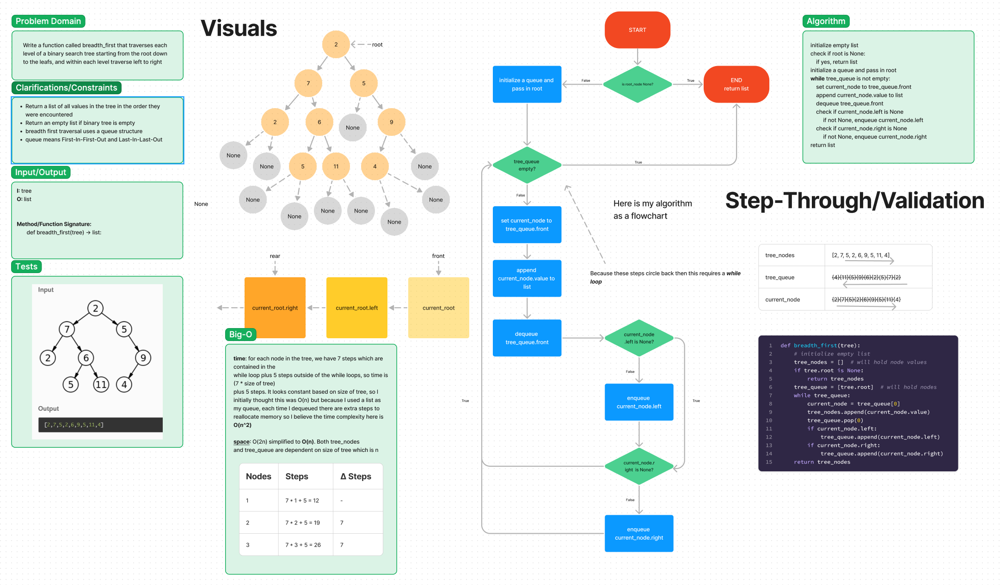

# Breadth-First Traversal
Traverse all the nodes in a tree using BFS (Breadth First Search) and return a list of its node values

## Whiteboard Process

[link to whiteboard](https://www.figma.com/file/cAmaDPQ7f7cr86dXc5Esix/tree_breadth_first?type=whiteboard&node-id=0-1&t=bcQ8BhoYxPpf7txA-0)

## Approach & Efficiency
I used a list as my queue structure. I enqueued nodes to the right side (end) of the list, and dequeued from the
left side (start) of the list. Because I used a list as my queue structure, my time complexity ended up being O(n^2)
and my space complexity was O(n).

## Solution
<!-- Show how to run your code, and examples of it in action -->

## Attribution
Class warm-up on 11/14 helped a ton because originally I was going to use the Queue class but using a list was much easier.

